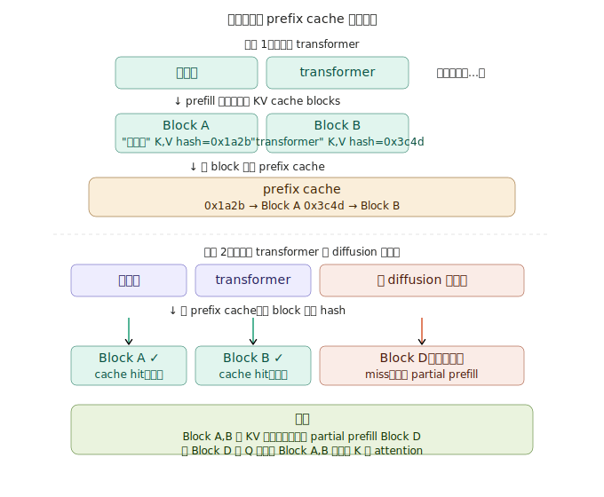
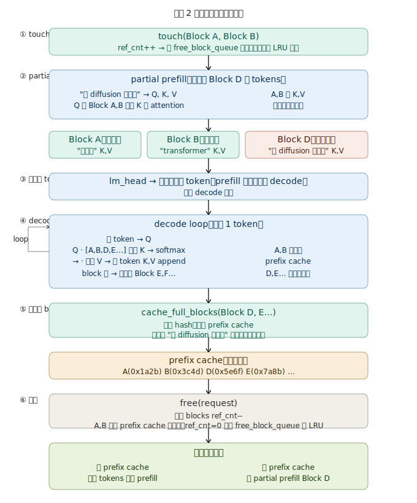
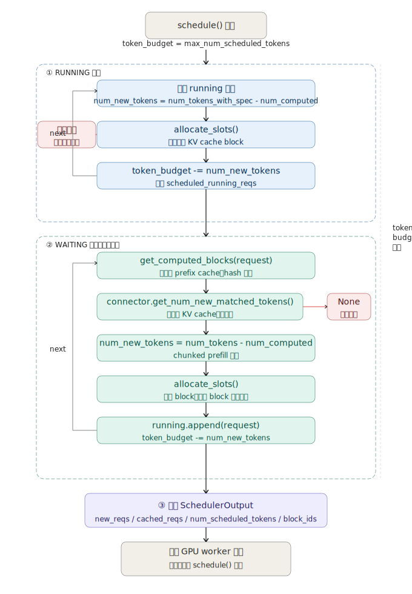

# vLLM 核心代码注释

对 vLLM v1 架构中 KV cache 管理、调度器、推理主循环的关键代码进行注释，帮助理解核心设计。

涉及文件：

- `vllm/entrypoints/llm.py` — 离线推理主循环
- `vllm/v1/core/block_pool.py` — KV cache block 池
- `vllm/v1/core/kv_cache_manager.py` — KV cache 管理入口
- `vllm/v1/core/kv_cache_utils.py` — block hash 计算
- `vllm/v1/core/sched/scheduler.py` — 调度器
- `vllm/v1/core/single_type_kv_cache_manager.py` — prefix cache 命中查找
- `vllm/v1/engine/core.py` — 在线推理主循环

---

## 一、KV cache 与 prefix caching 原理

### PagedAttention

vLLM 将 GPU 显存切成固定大小的 block（默认 16 个 token），按需分配，不预留，彻底消灭内存碎片。每个请求通过 block table 映射到物理 block，不同请求可以共享相同内容的 block。

### Prefix caching

每个满 block 计算一个 hash，相同前缀的请求直接复用已有 block 的 KV cache，跳过 prefill 重算。

**链式 hash 设计**（`kv_cache_utils.py: hash_block_tokens`）：

```
Block A hash = hash(NONE_HASH,   ["讲", "一", "下", ...])
Block B hash = hash(Block_A_hash, ["transformer", ...])
Block D hash = hash(Block_B_hash, ["和", "diffusion", ...])
```

Block B 的 hash 包含了 Block A 的 hash，隐式代表整个前缀历史。这保证了：相同 token 序列的相同位置 block，hash 必然一致，不同上下文下的相同 token 序列则 hash 不同，不会错误命中。

### 两个请求的 prefix cache 命中示例

请求 1：`讲一下 transformer`
请求 2：`讲一下 transformer 和 diffusion 的区别`

请求 2 进来时，前两个 block 和请求 1 完全一样，直接命中；"和 diffusion 的区别"部分 miss，需要 partial prefill。



命中后，只对未命中的 tokens 做 partial prefill，但这些 tokens 的 Q 仍需和历史 Block A、B 的 K 做 attention，读操作省不掉。



---

## 二、KV cache 管理核心函数

### `BlockPool.get_one_block`

```python
blocks = self._cache.get(key)
if isinstance(blocks, KVCacheBlock):
    return blocks         # 只有一个，直接返回
if isinstance(blocks, dict):
    return next(iter(blocks.values()))  # 多个，随便返回一个
```

同一个 hash 对应多个 block 的情况：两个请求同时计算相同前缀，产生了两个内容相同的 block。有多个时随便返回哪个都行，内容相同（相同 hash），KV 值一样。

### `BlockPool.get_cached_block`

```python
for group_id in kv_cache_group_ids:
    block_hash_with_group_id = make_block_hash_with_group_id(block_hash, group_id)
    block = self.cached_block_hash_to_block.get_one_block(block_hash_with_group_id)
    if not block:
        return None       # 任何一个 group miss → 整体返回 None
    cached_blocks.append(block)
return cached_blocks      # 全部命中 → 返回对应 block 列表
```

`group_id` 用于区分 hybrid attention 场景（不同层用不同 attention 类型），普通 decoder-only 模型只有 `group_id=0`。

### `make_block_hash_with_group_id`

```python
return BlockHashWithGroupId(block_hash + group_id.to_bytes(4, "big", signed=False))
```

把 group_id 的 4 个字节直接拼到 block_hash 后面，避免创建 tuple，节省 GC 开销。

### `FullAttentionManager.find_longest_cache_hit`

```python
for block_hash in itertools.islice(block_hashes, max_num_blocks):
    if cached_block := block_pool.get_cached_block(block_hash, kv_cache_group_ids):
        computed.append(cached)
    else:
        break  # 遇到第一个 miss 立刻停止
```

从头开始逐 block 查 hash，遇到 miss 立刻 break。必须是连续前缀，不能跳过中间的 miss。时间复杂度 O(命中 block 数)。

---

## 三、调度器（Scheduler）

`schedule()` 每步调用一次，决定哪些请求参与本步计算。没有独立的 prefill/decode 阶段，统一用 `num_computed_tokens` 追踪进度。



### 两个队列

**RUNNING 队列**：已在运行的请求，直接分配 block，分配失败则抢占低优先级请求释放显存。

**WAITING 队列**：新到达的请求，先查 prefix cache，再分配 block：

```python
# 查本地 prefix cache
new_computed_blocks, num_new_local_computed_tokens = (
    self.kv_cache_manager.get_computed_blocks(request)
)

# 查外部 KV cache（LMCache、Mooncake 等，可选）
if self.connector is not None:
    ext_tokens, load_kv_async = self.connector.get_num_new_matched_tokens(
        request, num_new_local_computed_tokens
    )

# 本地命中 + 外部命中 = 总共不需要重算的 token 数
num_computed_tokens = num_new_local_computed_tokens + num_external_computed_tokens
```

### Chunked prefill

```python
threshold = self.scheduler_config.long_prefill_token_threshold
if 0 < threshold < num_new_tokens:
    num_new_tokens = threshold
```

长 prompt 不一次性全部 prefill，切成小块，防止单个请求独占 GPU 太久，让 decode 请求也能插进来。

### Cascade attention

```python
num_common_prefix_blocks = self.kv_cache_manager.get_num_common_prefix_blocks(any_request_id)
```

统计所有 running 请求的公共前缀 block 数。公共前缀部分的 attention 只算一次，结果广播给所有请求。

---

## 四、推理主循环

### `EngineCore.step`（每步推理）

```python
scheduler_output = self.scheduler.schedule()

# GPU 异步执行
future = self.model_executor.execute_model(scheduler_output, non_block=True)

# CPU 同时计算 grammar bitmask（CPU/GPU 并行）
grammar_output = self.scheduler.get_grammar_bitmask(scheduler_output)

# 等 GPU 结果
model_output = future.result()

# GPU 只做 forward pass 时，CPU 端用 grammar bitmask 过滤后 sample
if model_output is None:
    model_output = self.model_executor.sample_tokens(grammar_output)

# 处理推理过程中发生的 abort
self._process_aborts_queue()

# 回写结果，更新 num_computed_tokens，释放完成请求的 block
engine_core_outputs = self.scheduler.update_from_output(scheduler_output, model_output)
```

GPU 执行和 grammar bitmask 计算并行，是 CPU/GPU overlap 的一个体现。

### 离线推理（`LLM._run_engine`）

```python
while self.llm_engine.has_unfinished_requests():
    step_outputs = self.llm_engine.step()
    for output in step_outputs:
        if output.finished:
            outputs.append(output)

# continuous batching 下完成顺序不确定，最后按 request_id 排序还原输入顺序
return sorted(outputs, key=lambda x: int(x.request_id))
```

同步等待所有请求完成后才返回。`step()` 每次可能返回多个请求的输出，只收集 `finished=True` 的。

### 在线推理（`EngineCoreProc.run_busy_loop`）

```
客户端请求 → input_queue → EngineCore 主线程 → output_queue → 网络 IO 线程 → 客户端
```

```python
while self._handle_shutdown():
    self._process_input_queue()   # 阻塞等新请求，批量取完提高 batch 大小
    self._process_engine_step()   # 跑一步，结果放进 output_queue
```

推理和网络 IO 完全解耦。有请求但 GPU 未执行时（等远程 KV 传输），`time.sleep(0.001)` 主动让出 GIL，避免饿死后台线程。

---

## 五、设计总结

| 机制 | 作用 |
|---|---|
| PagedAttention | 按需分配 block，消灭内存碎片 |
| 链式 hash | 保证相同前缀必然命中，不同上下文不会误命中 |
| Prefix caching | 跨请求复用 KV cache，节省 prefill 计算 |
| Chunked prefill | 长 prompt 分块处理，prefill/decode 交替，降低延迟 |
| Continuous batching | 多请求混合一个 batch，打满 GPU 利用率 |
| CPU/GPU overlap | grammar bitmask 和 GPU forward 并行，减少空泡 |
| 生产者消费者 | input_queue/output_queue 解耦推理和网络 IO |
